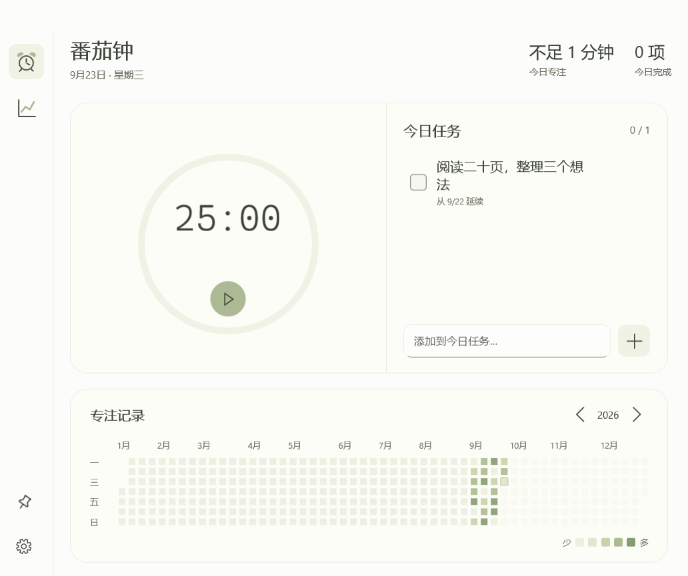
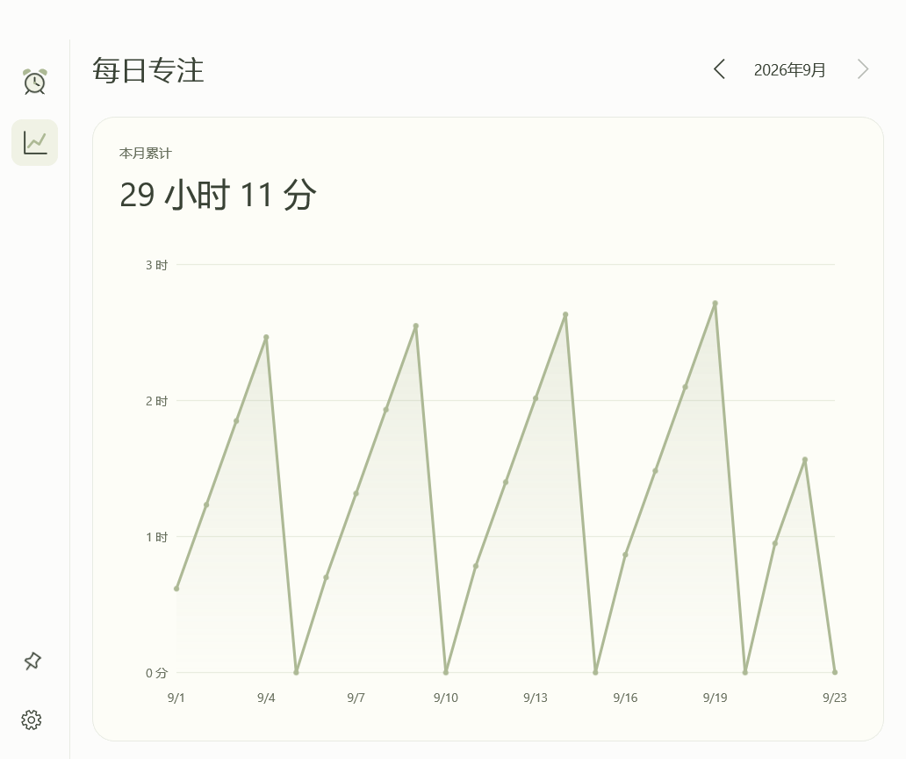

# 惜立番茄钟

一款适用于 Windows 10 / 11 的简洁番茄钟，使用浅鼠尾草绿配色、磨砂面板和流畅动画。原生 WinUI 3 界面，无声音、无账号、离线使用。



## 功能

- 点击时间直接修改时长，支持暂停、继续和结束；完成后弹出主窗口，等待手动开始下一轮。
- 今日任务支持添加、编辑、完成和删除，未完成任务自动跨天保留。
- 年度热力图按专注时长着色，悬停查看当天时长和已完成任务。
- 每日专注折线图、历史月份切换、窗口置顶、系统托盘、浅色/深色主题。
- 窗口缩放时自动调整布局；本地 SQLite 保存记录，支持 JSON 备份与恢复。



## 下载与运行

在 [Releases](https://github.com/yuudashichi/YuudachiPomodoro/releases) 下载 **YuudachiPomodoro-1.0.0-win-x64.zip**，完整解压到可写的文件夹，双击 **惜立番茄钟.exe** 即可。请保留同目录下的全部依赖文件，不要只复制 EXE。

压缩包包含 .NET 和 Windows App SDK 运行依赖，无需另装开发环境。目标为 Windows 10 22H2 / Windows 11 的 x64 电脑；不提供 x86 或 ARM64 原生版本。目前已在 Windows 10 22H2 验证，尚未进行 Windows 11 实机测试。

数据默认保存在 **应用目录下的 `data/xili.db`**，以程序所在目录为基准，不依赖启动时的工作目录，也没有写死盘符或用户路径。移动整个应用文件夹即可带走记录。仓库本地发布后对应 `dist/惜立番茄钟/data/xili.db`。发行压缩包不包含任何个人数据。

关闭窗口默认收进托盘，计时继续；完全退出并重启后，倒计时恢复上次设定的完整时长，等待手动开始，历史记录仍保留。计时期间约每 30 秒保存一次，异常退出可能损失最近未保存的片段。

## 开发

技术栈：C# / .NET 10、WinUI 3、Win2D、SQLite。构建需要 Windows x64、.NET 10 SDK 和 Windows SDK；首次还原依赖需联网。

```powershell
dotnet restore src/XiliPomodoro/XiliPomodoro.csproj --packages .packages --locked-mode
dotnet run --project tests/XiliPomodoro.Tests -c Release
powershell -NoProfile -ExecutionPolicy Bypass -File tools/publish.ps1
```

发布脚本从干净目录打包，将唯一可运行版本放在 `dist/惜立番茄钟`，保留该目录已有的 `data`，并将 ZIP 和 SHA-256 校验文件放在 `artifacts/packages`。源代码、发布包均排除数据库与个人备份。

- `src/XiliPomodoro.Core`：计时规则与统计模型。
- `src/XiliPomodoro`：桌面界面、SQLite 存储与系统集成。
- `tests`：核心测试与可选的界面回归工具；界面诊断代码不编入正式版。

执行 `tools/test-ui.ps1` 可运行隔离的界面回归并生成演示截图。截图使用合成数据，渲染不包含系统标题栏与桌面背景。第三方依赖声明见 [THIRD-PARTY-NOTICES.md](THIRD-PARTY-NOTICES.md)。
